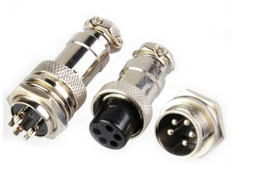
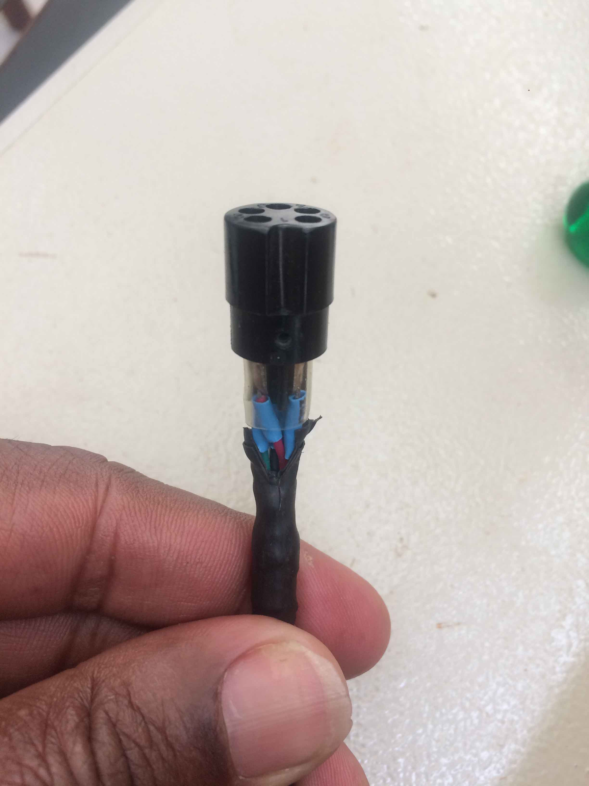
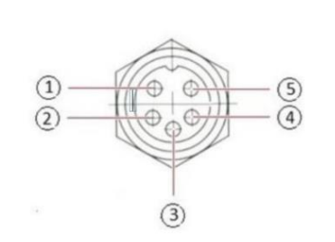

Freio de Prony de disco

Vista do lado do conector macho

Conector fêmea - ligação com a célula de carga

| pino |  cor     | HX711 | descrição   |  
|:----:|:--------:|:------:|:----------:|
| 1    | vermelho |  E+   | alimentação |  
| 2    | verde    |  A+   | ramo +      | 
| 3    | branco   |  A-   | ramo -      |
| 4    | preto    |  E-   | referência  |
| 5    | amarelo  |       | malha       | 